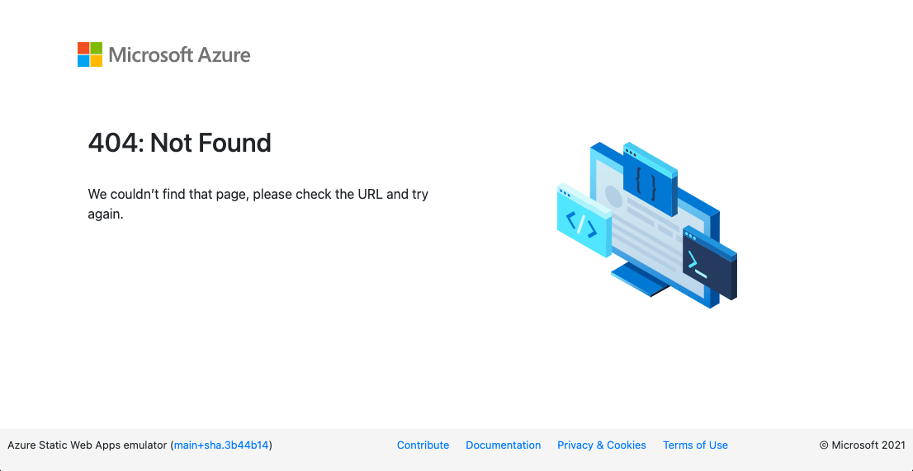

# Serve from Specific Folder

By default, the CLI serves the static content in the current folder (`./`) when this command is run:

```bash
swa start
```

Override this behavior to specify a different folder for your artifacts (e.g.,`./my-dist`) at the end of the command as follows:

```bash
swa start ./my-dist
```

Visit `http://localhost:4280` on browser to see the rendered SWA content.

## Troubleshooting: 404

You may see a **404** page rendered that looks something like this, indicating that a relevant SWA asset was not found. To troubleshoot:
 * Check that the command was run with the right folder option
 * Check that the targeted folder has a valid _index.html_ file.



