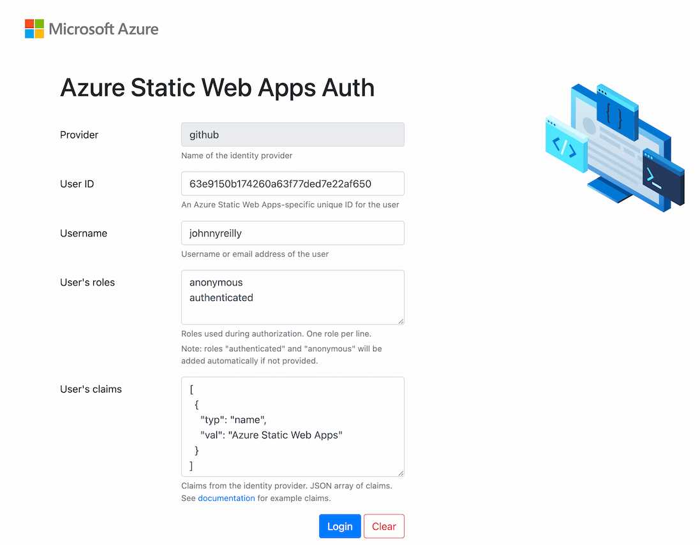

The CLI allows to mock and read authentication and authorization credentials.

### Mocking credentials

When requesting the Static Web Apps login endpoints (`http://localhost:4280/.auth/login/<PROVIDER_NAME>`), you have access to a local authentication UI. This interface is served locally from the emulator and allows you to set fake user information for the current user from the provider supplied.



### Reading credentials

The front-end application can request the `http://localhost:4280/.auth/me` endpoint and a `clientPrincipal` containing the fake information will be returned by the authentication API.

Here is an example:

```json
{
  "clientPrincipal": {
    "identityProvider": "twitter",
    "userId": "<USER-UUID>",
    "userDetails": "<USER_NAME>",
    "userRoles": ["anonymous", "authenticated"],
    "claims": [
      {
        "typ": "name",
        "val": "Azure Static Web Apps"
      }
    ]
  }
}
```

The API functions can access user information using the `x-ms-client-principal` header.

See [Accessing user information](https://docs.microsoft.com/azure/static-web-apps/user-information) documentation for more details.
