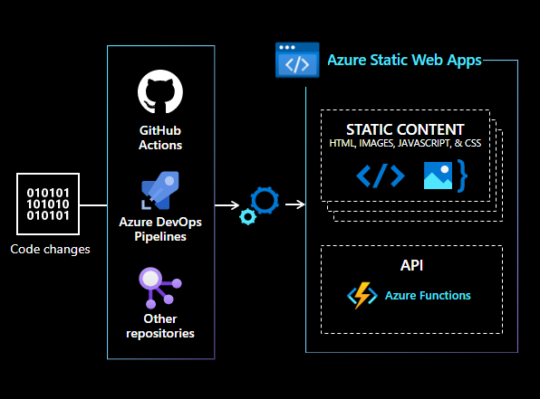

# About SWA CLI

The **Static Web Apps (SWA) CLI** is an open-source commandline tool that streamlines local development and deployment for Azure Static Web Apps.

- Find it on npm: [@azure/static-web-apps-cli](https://www.npmjs.com/package/@azure/static-web-apps-cli)
- Get Started: [Install the SWA CLI](https://azure.github.io/static-web-apps-cli/docs/use/install)
- Contribute: [Build from Source](https://azure.github.io/static-web-apps-cli/docs/contribute/developer)

---

## Static Web Apps

Azure Static Web Apps is a turnkey service for modern full-stack applications with pre-built or pre-rendered front-ends, and serverless backends. It became [generally available in May 2021](https://azure.microsoft.com/en-us/updates/azure-static-web-apps-is-now-generally-available/?WT.mc_id=30daysofswa-61155-cxall).

The Static Web Apps architecture views web apps as two components:

- **static content** like HTML, CSS, JS and media assets
- **dynamic API** for client interactions requiring data or processing

This allows the architecture to scale each component using technologies best suited to its type and purpose. Static content is hosted in globally-distributed content servers for fast delivery. Dynamic APIs are implemented using a serverless architecture, for cost-effective scaling on-demand.

**Developer benefits to using Static Web Apps**:

- works with [popular web frameworks and static site generators](https://docs.microsoft.com/en-us/azure/static-web-apps/front-end-frameworks)
- quickstarts with [VS Code, Azure Portal and CLI](https://docs.microsoft.com/en-us/azure/static-web-apps/getting-started?tabs=vanilla-javascript) options
- automated CI/CD with [GitHub](https://docs.microsoft.com/en-us/azure/static-web-apps/getting-started?tabs=vanilla-javascript), [GitLab](https://docs.microsoft.com/en-us/azure/static-web-apps/gitlab?tabs=vanilla-javascript) and [Bit Bucket](https://docs.microsoft.com/en-us/azure/static-web-apps/bitbucket?tabs=vanilla-javascript) options.

Visit the [Azure Static Web Apps Documentation](https://docs.microsoft.com/en-us/azure/static-web-apps/) for more information.

## About SWA CLI

The Static Web Apps CLI (**SWA CLI** or `swa`) is an [open-source](https://github.com/Azure/static-web-apps-cli) command-line tool to streamline the local development experience for [Azure Static Web Apps](https://docs.microsoft.com/azure/static-web-apps) - from setup to deployment.

**Key Features of SWA CLI**:

- Serve static app assets, or proxy to your app dev server
- Serve API requests or proxy to APIs in Azure Functions Core Tools
- Emulate authentication and authorization (with mock responses)
- Emulate Static Web Apps configuration (for routing & role-based auth)
- Deploy to Azure Static Web Apps (streamlined develop-deploy workflow)

## Components of CLI

The figure illustrates the high-level architecture for the Static Web Apps CLI, identifying the key components and their relationships:

**1. Reverse Proxy:** This is the heart of SWA CLI. It intercepts and forwards HTTP requests to the right components based on the purpose:

- `/.auth/**` requests => forwarded to the Auth emulator server.
- `/api/**` requests => forwarded to `localhost` functions (if present).
- `/**` => all other requests forwarded to the static assets content server.

**2. Authentication Server (Emulator):**

- Emulates auth flow
- Returns mock responses.

**3. Static Content Server**.

- Serves static assets (HTML, CSS, JS, media files)
- Useful for local testing, validation of user experience
- Default target for requests not handled by other components

**4. Serverless API server**.

- Useful for local API testing (if used)
- Requires (and has API endpoints served by) Azure Functions Core Tools.

:::warning Always test on Azure for production!
The Static Web Apps CLI is a convenience for local development and testing. It uses _emulated_ services so differences from real-world behaviors are to be expected. Always test final application on Azure using preview and production environments, to validate behavior.
:::

## Contributing to CLI

This is an open-source project made for the benefit of our developer community. Your feedback and contributions are key to its success.

**Here are some ways to help:**

- Discovered buggy or unusual behavior? [Send us a bug report](https://github.com/Azure/static-web-apps-cli/issues/new?assignees=&labels=&template=bug_report.md&title=)
- Have a feature request? [Send us a Feature Request](https://github.com/Azure/static-web-apps-cli/issues/new?assignees=&labels=&template=feature_request.md&title=)
- Found a security vulnerability? [Report Security Issues](https://github.com/Azure/static-web-apps-cli/security/policy)
- Have other questions or comments? [Post to our Discussions board](https://github.com/Azure/static-web-apps-cli/discussions)
- Posting questions to Stack Overflow? [Post to the swa-cli tag](https://stackoverflow.com/questions/tagged/swa-cli)

Contribute directly to the project by fixing bugs, writing (or improving) documentation, and proposing (or implementing) new features. To start:

- Review our [Contributor Guidelines](/docs/contribute/intro)!
- Learn to [Build Project From Source](/docs/contribute/intro)!

Thank you for your continued support! ♥️
