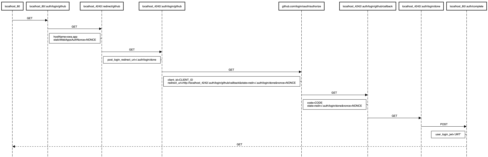

<p align="center">
    <h2 align="center">Azure Static Web Apps Emulator</h2>
</p>
<p align="center">
    
</p>

Introducing SWA EMU, the Azure Static Web Apps Emulator that serves as a local emulator for [Azure Static Web Apps](https://bit.ly/2ZNcakP). It can:

- Auto-build your local APP and API
- Emulate Authentication
- Serve API requests
- Serve static APP assets

## High-level architecture


The SWA EMU is built on top of the following components:

- The Reverse Proxy: this is the heart of the SWA EMU, it's the piece that forwards all HTTP requests to the appropriate components:
  - `/.auth/**` requests are forwarded to the Auth Emulator server.
  - `/api/**` requests are forwarded to the localhost API function (if available).
  - `/**` all other requests are forwarded to the static assets server (serving the front-end app).
- The Auth Emulator server: emulates the whole authentication flow.
- The Static content server: serves the local app static content.
- The Serverless API server (baked by the Azure Function App).

Before SWA EMU bootstraps, it also can read (using the `--build` options) the local SWA github workflow file (created by [Azure Static Web Apps](https://bit.ly/2ZNcakP)) and builds both the static app and the api according to the user's config. And pretty much like SWA, if the user isn't using an API, SWA EMU will skip the API build.

## Authentication emulation flow

The Authentication flow is illustrated in the following sequence diagram (or [open in a new tab](https://bit.ly/swa-auth-flow)):



## Disclaimer

SWA EMU is still in developer preview and not yet ready for prime time. You will encounter issues, so please report them or help us fix them. Your contributions will be very appreciated 🙏

## Quick start

Using `npm` or `yarn`:

- Install the emulator: `npm install -g @manekinekko/swa-emu@latest`
- Open a SWA app folder at the root (outside any /api or /app folders): `cd my-awesome-swa-app`
- Start the emulator: `swa`
- Access your SWA app from `http://localhost`

Using `npx`:

- Open a SWA app folder at the root (outside any /api or /app folders): `cd my-awesome-swa-app`
- Start the emulator: `npx @manekinekko/swa-emu@latest`
- Access your SWA app from `http://localhost`

### Use with a local dev server

When developing locally on your front-end application, it might be usefull to use your local application dev server, that comes with your application CLI, to serve your app content and benefit from the built-in feature like the livereload or HMR (hot module reload) features.

In order to use SWA EMU with your local dev server, use the following command:

```
$ swa --use-dev-server=http://<dev-server-host>:<dev-server-port>`
```

Here are the default ports used by popular dev servers:

- If you are using the [Angular CLI](https://angular.io/cli):
```
swa --use-dev-server=http://localhost:4200`
```
- If you are using the [Vue CLI](https://cli.vuejs.org/):
```
swa --use-dev-server=http://localhost:8080`
```
- If you are using [Create React App](https://reactjs.org/docs/create-a-new-react-app.html):
```
swa --use-dev-server=http://localhost:3000`
```
- If you are using [Webpack dev server](https://github.com/webpack/webpack-dev-server):
```
swa --use-dev-server=http://localhost:8080`
```

## Configuration

SWA EMU binds to these default hosts:

- `http://localhost:4242`: for _emulated_ authentication.
- `http://localhost:7071`: for the API (baked by the Azure Function App)
- `http://localhost:4200`: for app assets (the front-end app)

If you need to override the default values, provide the following options:

| Options              | Description                           | Default                 | Example                                     |
| -------------------- | ------------------------------------- | ----------------------- |---------------------------------------------|
| `--api-prefix`       | the API URL prefix                    | `api`                   | `swa --api=prefix=my-api-route`             |
| `--auth-uri`         | the Auth URI                          | `http://localhost:4242` | `swa --auth-uri=http://localhost:8083`      |
| `--api-uri`          | the API URI                           | `http://localhost:7071` | `swa --api-uri=http://localhost:8082`       |
| `--app-uri`          | the app URI                           | `http://localhost:4200` | `swa --app-uri=http://localhost:8081`       |
| `--use-dev-server`   | use the app dev server                | `null`                  | `swa --use-dev-server=http://localhost:8080`|
| `--host`             | the emulator host address             | `0.0.0.0`               | `swa --host=192.168.68.80`                  |
| `--port`             | the emulator port value               | `80`                    | `swa --port=8080`                           |
| `--build`            | build the api and app before starting | `false`                 | `swa --build`                               |
| `--verbose`          | enable debug logs                     | `false`                 | `swa --verbose`                             |
| `--ui`               | enable dashboard UI                   | `false`                 | `swa --ui`                                  |

## Auth emulation

The emulator supports local authentication flow and mocks the following providers:

| Provider | Endpoint              | Local Emulation |
| -------- | --------------------- | --------------- |
| GitHub   | `.auth/login/github`  | ✅              |
| Twitter  | `.auth/login/twitter` | ✅              |
| Google   | `.auth/login/google`  | ✅              |
| Facebook | `.auth/login/facbook` | ✅              |
| AAD      | `.auth/login/aad`     | ✅              |

When requesting the `.auth/me` endpoint, a mocked user `clientPrincipal` will be returned by the emulator. Here is an example:

```json
{
  "clientPrincipal": {
    "identityProvider": "twitter",
    "userId": "59cd31faa8c34919ac22c19af50482b8",
    "userDetails": "manekinekko",
    "userRoles": [
      "anonymous",
      "authenticated"
    ]
  }
}
```

> NOTE: user roles and ACL are not yet supported (see [#7](https://github.com/manekinekko/swa-emulator/issues/7)).

## Caveats

- Custom routes are not yet supported (see [#6](https://github.com/manekinekko/swa-emulator/issues/6))
- Authorization and roles are not supported (see [#7](https://github.com/manekinekko/swa-emulator/issues/7)).
- The emulator is serving all traffic over HTTP (HTTPS support will be added soon) (see [#4](https://github.com/manekinekko/swa-emulator/issues/4)).
- When using GitHub, the OAuth client ID and client secret are provided as-is for dev purposes ONLY. You should create your own OAuth GitHub app!

## Troubleshooting

### Port 4242 is unavailable

This means that there is already an instance of Azure Functions Core Tools (assigned to the Auth Emulator) that is running and bound to the default port `4242`.

To fix it, either:

- close the other running instance, and run the emulator again.
- run the emulator using a different port: `--auth-uri=http://localhost:4243`
- force close the other instance by killing its processes: `lsof -t -i tcp:4242 | xargs kill`

### Error: listen EADDRINUSE: address already in use 0.0.0.0:80

This error indicates that another app is running and bound to the default port of the emulator: `80`.

To fix it, either:

- close the other running instance, and run the emulator again.
- run the emulator using a different port: `--port=8081`
- force close the other instance by killing its processes: `lsof -t -i tcp:80 | xargs kill`

## Want to help? [](https://github.com/manekinekko/swa-emu/issues)

Want to file a bug, contribute some code, or improve the documentation? Excellent! Read up on our guidelines for [contributing](https://github.com/manekinekko/swa-emu/blob/master/CONTRIBUTING.md) and then check out one of our issues in the list: [community-help](https://github.com/manekinekko/swa-emu/issues).
