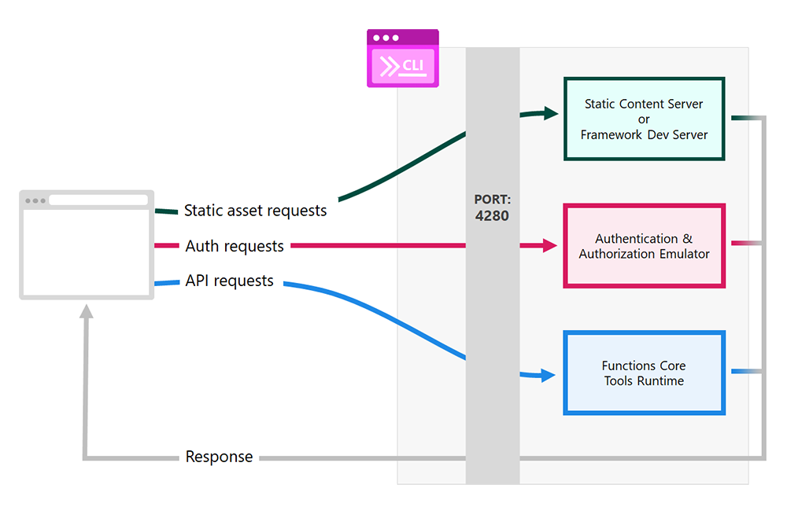

<p align="center">
    <h2 align="center">Azure Static Web Apps CLI </h2>
</p>
<p align="center">
    
</p>

The Static Web Apps CLI, also known as SWA CLI, serves as a local development tool for [Azure Static Web Apps](https://docs.microsoft.com/azure/static-web-apps). It can:

- Serve static app assets, or proxy to your app dev server
- Serve API requests, or proxy to APIs running in Azure Functions Core Tools
- Emulate authentication and authorization
- Emulate Static Web Apps configuration, including routing and ACL roles
- Deploy your app to Azure Static Web Apps

## Important Notes

If you have suggestions or you encounter issues, please report them or help us fix them. Your contributions are very much appreciated. 🙏

The CLI emulates commonly used capabilities of the Azure Static Web Apps cloud service. **Some differences are expected. Always deploy and test your apps in Azure to confirm behavior.**

## Quickstart

### Using `npm` or `yarn`:

- Install the cli

  ```bash
  npm install -g @azure/static-web-apps-cli
  ```

  > Note: The CLI can also be installed locally as a devDependency: `npm install -D @azure/static-web-apps-cli`. This is highly recommended.

- Open a SWA app folder at the root (outside any /api or /app folders):
  ```bash
  cd my-awesome-swa-app
  ```
- Create a configuration for your project:
  ```bash
  swa init
  ```
- Start the emulator:
  ```bash
  swa start
  ```
- Access your SWA app from `http://localhost:4280`

See all available [options](#cli-options).

### Using `npx`:

- Open a SWA app folder at the root (outside any /api or /app folders):

```bash
cd my-awesome-swa-app
```

- Create a configuration for your project:

```bash
npx @azure/static-web-apps-cli init
```

- Start the emulator:

```bash
npx @azure/static-web-apps-cli start
```

- Access your SWA app from `http://localhost:4280`

See all available [options](#cli-options).

## Start the emulator

### Serve from a folder

By default, the CLI starts and serves any the static content from the current working directory `./`:

```bash
swa start
```

However, you can override this behavior. If the artifact folder of your static app is under a different folder (e.g. `./my-dist`), then run the CLI and provide that folder:

```bash
swa start ./my-dist
```

### Serve from a dev server

When developing your front-end app locally, it's often useful to use the dev server that comes with your front-end framework's CLI to serve your app content. Using the framework CLI allows you to use built-in features like the livereload and HMR (hot module replacement).

To use SWA CLI with your local dev server, follow these two steps:

1. Start your local dev server (as usual). For example, if you are using Angular: `ng serve` (or `npm start`)
1. In a separate terminal, run `swa start` with the URI provided by the dev server, in the following format:

```bash
swa start http://<APP_DEV_SERVER_HOST>:<APP_DEV_SERVER_PORT>
```

Here is a list of the default ports used by some popular dev servers:

| Tool                                                                               | Port | Command                           |
| ---------------------------------------------------------------------------------- | ---- | --------------------------------- |
| [Angular](https://angular.io/cli)                                                  | 4200 | `swa start http://localhost:4200` |
| [Blazor WebAssembly](https://dotnet.microsoft.com/apps/aspnet/web-apps/blazor)     | 5000 | `swa start http://localhost:5000` |
| [Gatsby](https://www.gatsbyjs.com/docs/gatsby-cli/)                                | 8000 | `swa start http://localhost:8000` |
| [Hugo](https://gohugo.io/commands/hugo_server/)                                    | 1313 | `swa start http://localhost:1313` |
| [Next.js](https://nextjs.org/)                                                     | 3000 | `swa start http://localhost:3000` |
| [React (Create React App)](https://reactjs.org/docs/create-a-new-react-app.html)   | 3000 | `swa start http://localhost:3000` |
| [Svelte (sirv-cli)](https://github.com/lukeed/sirv/tree/master/packages/sirv-cli/) | 5000 | `swa start http://localhost:5000` |
| [Vue](https://cli.vuejs.org/)                                                      | 8080 | `swa start http://localhost:8080` |

Instead of starting a dev server separately, you can provide the startup command to the CLI.

```bash
# npm start script (React)
swa start http://localhost:3000 --run "npm start"

# dotnet watch (Blazor)
swa start http://localhost:5000 --run "dotnet watch run"

# Jekyll
swa start http://localhost:4000 --run "jekyll serve"

# custom script
swa start http://localhost:4200 --run "./startup.sh"
```

Then access the application with the emulated services from `http://localhost:4280`

### Serve both the front-end app and API

If your project includes API functions, the CLI will check if the Azure Functions Core Tools are installed and available. If not, the CLI will download and install the right version of the Azure Functions Core Tools.

#### Start the API server automatically

Run the CLI and provide the folder that contains the API backend (a valid Azure Functions App project):

```bash
# static content plus an API
swa start ./my-dist --api-location ./api

# front-end dev server plus an API
swa start http://localhost:3000 --api-location ./api
```

#### Start API server manually

When developing your backend locally, sometimes it's useful to run Azure Functions Core Tools separately to serve your API. This allows you to use built-in features like debugging and rich editor support.

To use the CLI with your local API backend dev server, follow these two steps:

1. Start your API using Azure Functions Core Tools: `func host start` or start debugging in VS Code.
2. In a separate terminal, run the SWA CLI with the `--api-location` flag and the URI of the local API server, in the following format:

```bash
swa start ./my-dist --api-location http://localhost:7071
```

## Deploy to Azure Static Web Apps

The CLI can also be used to deploy an app to Azure Static Web Apps using the command: `swa deploy`. Here are some common use cases:

1. Deploy a front-end app without an API
2. Deploy a front-end app with an API
3. Deploy a Blazor app

A **Deployment Token** is required in order to make a deployment! Read the steps below to learn how to access a deployment token.

### Deployment token

The CLI supports Deployment token. This is usually useful when deploying from a CI/CD environment. You can get a deployment token either from:

- The [Azure portal](https://portal.azure.com/): **Home → Static Web App → Your Instance → Overview → Manage deployment token**

- If you are using the [Azure CLI](https://aka.ms/azcli), you can get the deployment token of your project using the following command:

```bash
az staticwebapp secrets list --name <application-name> --query "properties.apiKey"
```

- If you are using the [Azure Static Web Apps CLI (this project)](aka.ms/swa/cli-local-development), you can get the deployment token of your project using the following command:

```bash
swa deploy --print-token
```

You can then use that value with the `--deployment-token <token>` (e.g. from a CI/CD environment), or you can create an environment variable called `SWA_CLI_DEPLOYMENT_TOKEN` and set it to the deployment token. Read the next section for more details.

**IMPORTANT:** Don't store the deployment token in a public repository. It should be kept secret!

### Deploy a front-end app without an API

You can deploy a front-end application (without an API) to Azure Static Web Apps by running the following steps:

1. If your front-end application requires a build step, run the build step (e.g. `npm run build`) or refer to your application build instructions.

**Option 1:** From build folder you would like to deploy, run the deploy command:

```bash
cd build/
swa deploy
```

> Note: the "build" folder must contain the static content of your app to be deployed!

**Option 2:** You can also deploy a specific folder:

1. If your front-end application requires a build step, run the build step (e.g. `npm run build`) or refer to your application build instructions.

2. Deploy your app:

```bash
swa deploy ./my-dist
```

### Deploy a front-end app with an API

To deploy both the front-end app and an API to Azure Static Web Apps, use the following steps:

1. If your front-end application requires a build step, run the build step (e.g. `npm run build`) or refer to your application build instructions.

2. Make sure the[ API language runtime version](https://docs.microsoft.com/en-us/azure/static-web-apps/configuration#platform) in the `staticwebapp.config.json` file is set correctly, for example:

```json
{
  "platform": {
    "apiRuntime": "node:16"
  }
}
```

3. Deploy your app:

```bash
swa deploy ./my-dist --api-location ./api
```

### Deploy a Blazor app

To deploy a Blazor app with (optional) an API to Azure Static Web Apps, use the following steps:

1. Build your Blazor app in Release mode:

```bash
dotnet publish -c Release
```

2. From the root of your project, run the deploy command:

```bash
swa deploy ./Client/bin/Release/net6.0/publish/wwwroot --api-location ./Api
```

### Deploy using the `swa-cli.config.json`

If you are using a [`swa-cli.config.json`](#swa-cli.config.json) configuration file in your project and have a single configuration entry, for example:

```json
{
  "configurations": {
    "my-app": {
      "appLocation": "./",
      "apiLocation": "api",
      "outputLocation": "frontend",
      "start": {
        "outputLocation": "frontend"
      },
      "deploy": {
        "outputLocation": "frontend"
      }
    }
  }
}
```

Then you can deploy your application by running the following steps:

1. If your front-end application requires a build step, run the build step (e.g. `npm run build`) or refer to your application build instructions.

2. Deploy your app:

```bash
swa deploy
```

If you have multiple configuration entries, you can provide the entry ID to specify which one to use:

```bash
swa deploy my-otherapp
```

## Use a runtime configuration file (staticwebapp.config.json)

Azure Static Web Apps can be configured with an optional `staticwebapp.config.json` file. For more information, see [Configure Static Web Apps documentation](https://docs.microsoft.com/azure/static-web-apps/configuration).

If you are serving static files from a folder, the CLI will search this folder for `staticwebapp.config.json`.

```bash
# this assumes that ./my-dist or its subfolders contains a staticwebapp.config.json file
swa start ./my-dist
```

If you are using a front-end dev server, the CLI will search the current directory for `staticwebapp.config.json`.

```bash
# current working directory is searched for staticwebapp.config.json
swa start http://localhost:3000
```

To control where the CLI searches for `staticwebapp.config.json`, use `--swa-config-location`.

```bash
# static files
swa start ./my-dist --swa-config-location ./my-app-source

# front-end dev server
swa start http://localhost:3000 --swa-config-location ./my-app-source
```

## CLI options

### Top-level `swa` options

If you need to override the default values for the `swa` command, you can provide the following options:

| Option                  | Description                                                        | Default                 | Example                                   |
| ----------------------- | ------------------------------------------------------------------ | ----------------------- | ----------------------------------------- |
| `--verbose`             | Enable verbose output. Values are: `silly, info, log, silent`      | `log`                   | `--verbose=silly`                         |
| `--config`              | Path to [`swa-cli.config.json`](#swa-cli.config.json) file to use  | `./swa-cli.config.json` | `--config=./path/to/swa-cli.config.json`  |
| `--print-config`        | Print all resolved options                                         | `false`                 | `--print-config` or `--print-config=true` |
| `--swa-config-location` | The directory where the `staticwebapp.config.json` file is located | `./`                    | `--swa-config-location=./app`             |

### Subcommand `swa login` options

TODO

### Subcommand `swa start` options

If you need to override the default values for the `swa start` subcommand, you can provide the following options:

| Option                | Description                                                                                                    | Default   | Example                                                            |
| --------------------- | -------------------------------------------------------------------------------------------------------------- | --------- | ------------------------------------------------------------------ |
| `--app-location`      | The folder containing the source code of the front-end application                                             | `./`      | `--app-location="./app"`                                           |
| `--api-location`      | The folder containing the source code of the API application. This could also be an URL to a `func` dev server | `./api`   | `--api-location="./api"` or `--api-location=http://localhost:8083` |
| `--api-port`          | The API server port passed to `func start`                                                                     | `7071`    | `--api-port=8082`                                                  |
| `--host`              | The host address to use for the CLI dev server                                                                 | `0.0.0.0` | `--host=192.168.68.80`                                             |
| `--port`              | The port value to use for the CLI dev server                                                                   | `4280`    | `--port=8080`                                                      |
| `--ssl`               | Serve the front-end application and API over HTTPS                                                             | `false`   | `--ssl` or `--ssl=true`                                            |
| `--ssl-cert`          | The SSL certificate (.crt) to use when enabling HTTPS                                                          |           | `--ssl-cert="/home/user/ssl/example.crt"`                          |
| `--ssl-key`           | The SSL key (.key) to use when enabling HTTPS                                                                  |           | `--ssl-key="/home/user/ssl/example.key"`                           |
| `--run`               | Run a custon shell command or file at startup                                                                  |           | `--run="cd app & npm start"`                                       |
| `--devserver-timeout` | The time (in milliseconds) to wait when connecting to a front-end application's dev server                     | `30000`   | `--devserver-timeout=60000`                                        |
| `--func-args`         | Pass additional arguments to the `func start` command                                                          |           | `--func-args="--javascript"`                                       |
| `--open`              | Automatically open the CLI dev server in the default browser.                                                  | `false`   | `--open` or `--open=true`                                          |

### Subcommand `swa deploy` options

If you need to override the default values for the `swa deploy` subcommand, you can provide the following options:

| Option               | Description                                                                                                                               | Default   | Example                                   |
| -------------------- | ----------------------------------------------------------------------------------------------------------------------------------------- | --------- | ----------------------------------------- |
| `--api-location`     | The folder containing the source code of the API application                                                                              | `./api`   | `--api-location="./api"`                  |
| `--deployment-token` | The secret toekn used to authenticate with the Static Web Apps                                                                            |           | `--deployment-token="123"`                |
| `--dry-run`          | Simulate a deploy process without actually running it                                                                                     | `false`   | `--dry-run`                               |
| `--print-token`      | print the deployment token                                                                                                                | `false`   | `--print-token`                           |
| `--env`              | the type of deployment environment where to deploy the project                                                                            | `preview` | `--env="production"` or `--env="preview"` |
| `--print-token`      | Print the deployment token. Usefull when using `--deployment-token` on CI/CD <br> Note: this command does not run the deployment process. | `false`   | `--print-token`                           |

The deploy command does also support the same options as the `swa login` command.

<a id="swa-cli.config.json"></a>

## The CLI `swa-cli.config.json` configuration file

The CLI can also load options from a `swa-cli.config.json` file:

```json
{
  "configurations": {
    "app": {
      "outputLocation": "http://localhost:3000",
      "apiLocation": "api",
      "run": "npm run start",
      "swaConfigLocation": "./my-app-source"
    }
  }
}
```

If only a single configuration is present in the `swa-cli.config.json` file, running `swa start` will use it by default. Options passed in via command line will always override any settings set in the `swa-cli.config.json` file.

### Example

We can simplify these commands by putting the options into a config file:

```bash
# static configuration
swa start ./my-dist --swa-config-location ./my-app-source

# devserver configuration
swa start http://localhost:3000 --swa-config-location ./my-app-source
```

```json
{
  "configurations": {
    "static": {
      "outputLocation": "./my-dist",
      "swaConfigLocation": "./my-app-source"
    },
    "devserver": {
      "outputLocation": "http://localhost:3000",
      "swaConfigLocation": "./my-app-source"
    }
  }
}
```

These configurations can be run with `swa start static` and `swa start devserver`.

### Validation

You can validate your `swa-cli.config.json` with a JSON Schema like so:

```json
{
  "$schema": "https://raw.githubusercontent.com/Azure/static-web-apps-cli/main/schema/swa-cli.config.schema.json",
  "configurations": {
    ...
  }
}
```

## Local authentication & authorization emulation

The CLI allows to mock and read authentication and authorization credentials.

### Mocking credentials

When requesting the Static Web Apps login endpoints (`http://localhost:4280/.auth/login/<PROVIDER_NAME>`), you have access to a local authentication UI. This interface is served locally from the emulator and allows you to set fake user information for the current user from the provider supplied.

### Reading credentials

The front-end application can request the `http://localhost:4280/.auth/me` endpoint and a `clientPrincipal` containing the fake information will be returned by the authentication API.

Here is an example:

```json
{
  "clientPrincipal": {
    "identityProvider": "twitter",
    "userId": "<USER-UUID>",
    "userDetails": "<USER_NAME>",
    "userRoles": ["anonymous", "authenticated"],
    "claims": [
      {
        "typ": "name",
        "val": "Azure Static Web Apps"
      }
    ]
  }
}
```

The API functions can access user information using the `x-ms-client-principal` header.

See [Accessing user information](https://docs.microsoft.com/azure/static-web-apps/user-information) documentation for more details.

## High-level architecture



The SWA CLI is built on top of the following components:

- A **Reverse Proxy** is the heart of the SWA CLI; it's the piece that forwards all HTTP requests to the appropriate components:
  - `/.auth/**` requests are forwarded to the Auth emulator server.
  - `/api/**` requests are forwarded to the localhost API function (if available).
  - `/**` all other requests are forwarded to the static assets server (serving the front-end app).
- The **Auth emulator server** emulates the whole authentication flow.
- The **Static content server** serves the local app static content.
- The **Serverless API server** is served by Azure Functions Core Tools.

## Want to help? [](https://github.com/azure/static-web-apps-cli/issues)

Want to file a bug, contribute some code, or improve the documentation? Excellent! Read up on our guidelines for [contributing](https://github.com/azure/static-web-apps-cli/blob/master/CONTRIBUTING.md) and then check out one of our issues in the list: [community-help](https://github.com/azure/static-web-apps-cli/issues).
